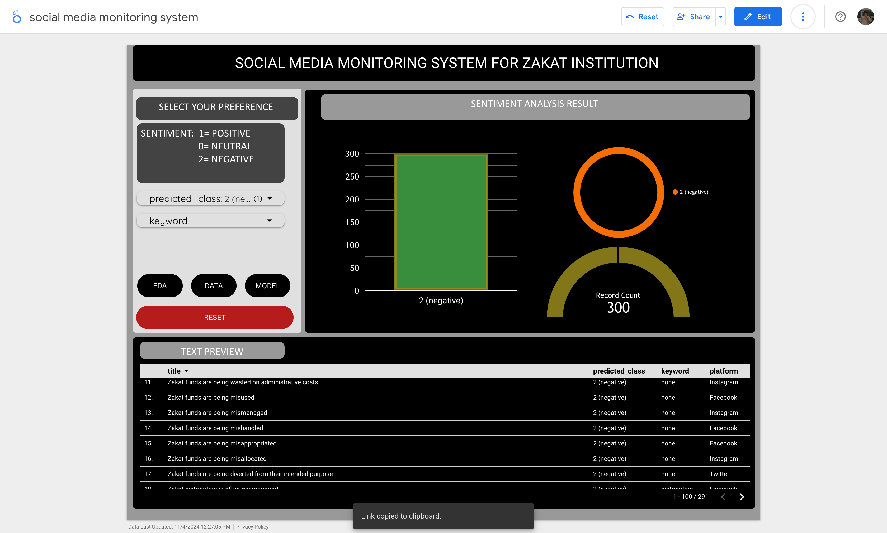

# social-media-monitoring-zakat
This repository contains the backend implementation for my final year project, Social Media Monitoring System for Zakat Institutions. The system leverages machine learning, specifically the BERT model, to perform sentiment analysis on social media data. The goal of this project is to enhance transparency, efficiency, and impact in Zakat collection and distribution by analyzing public sentiment and providing actionable insights.

## Project Overview

- **Frontend**: Built with Looker Studio for data visualization and user interaction.
- **Backend**: BERT model implemented in Python for sentiment analysis.

## Features

- Social media sentiment analysis using BERT.
- Interactive dashboards for data visualization (accessible via [Looker Studio Dashboard]).
- Backend developed using Python and Google Colab.

## Repository Structure

- `backend/`: Contains the BERT model code and related scripts.

## Dashboard Preview

